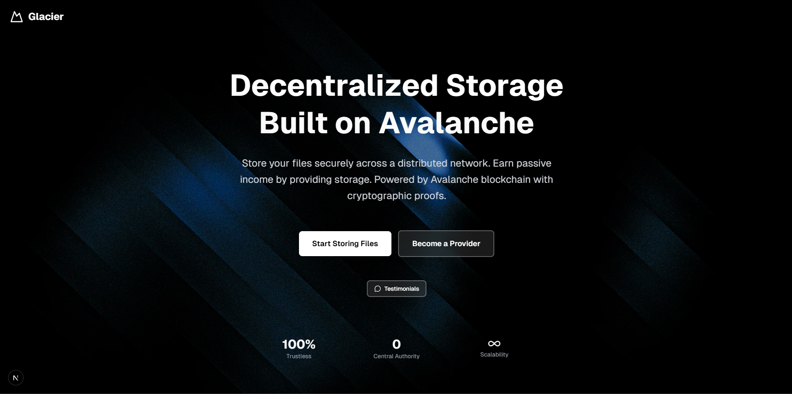
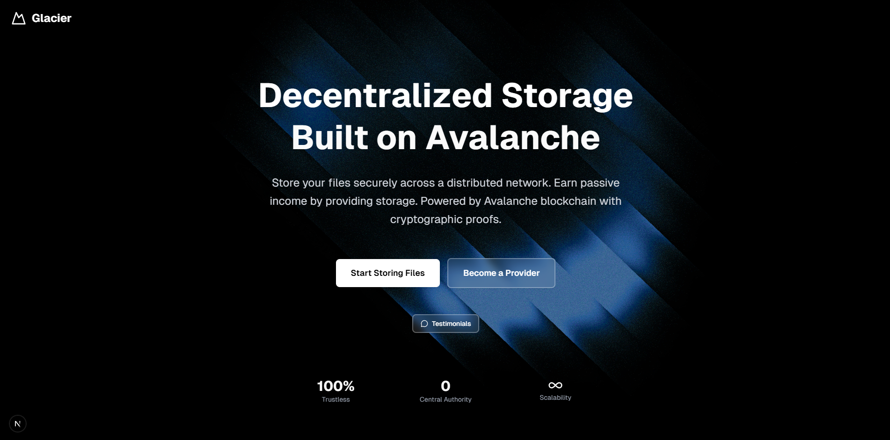
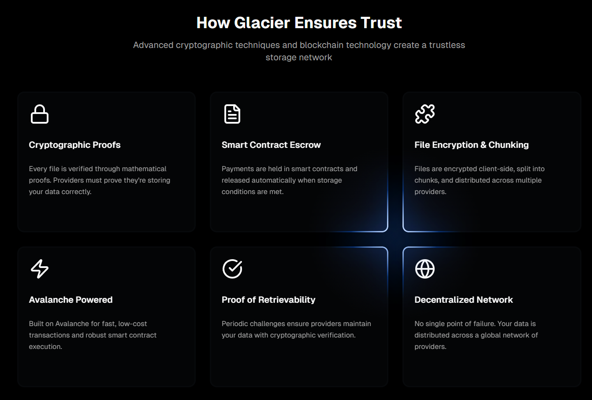
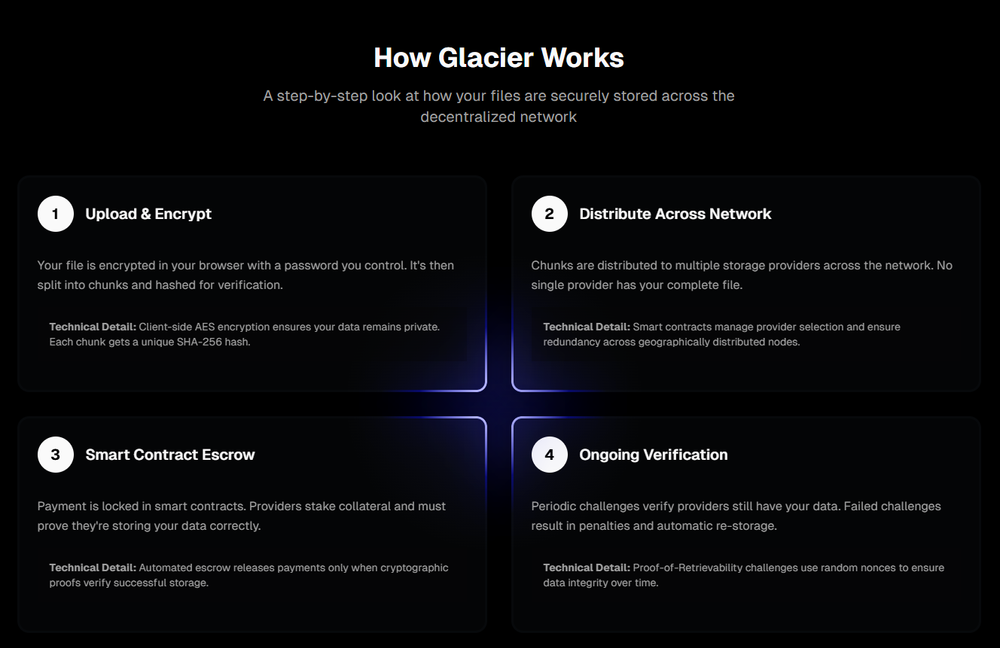
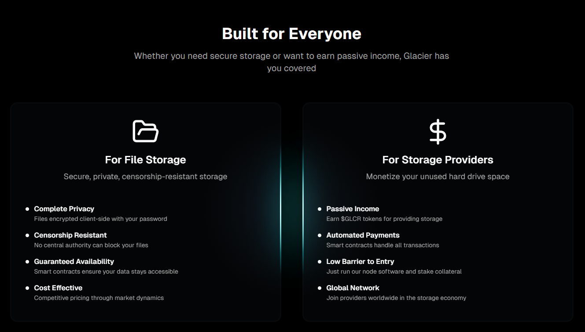
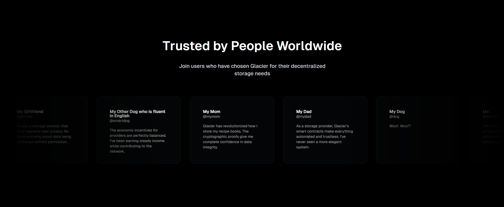
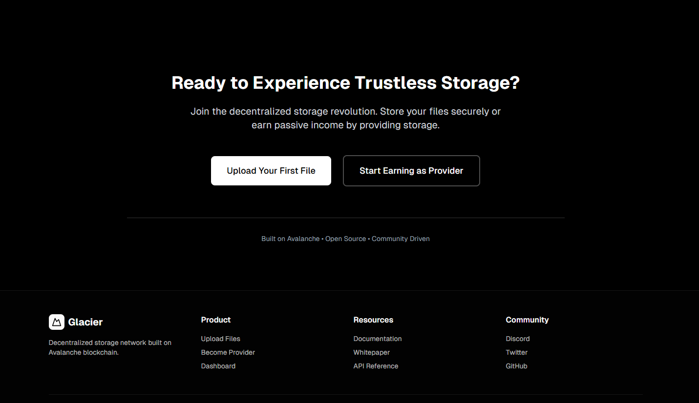
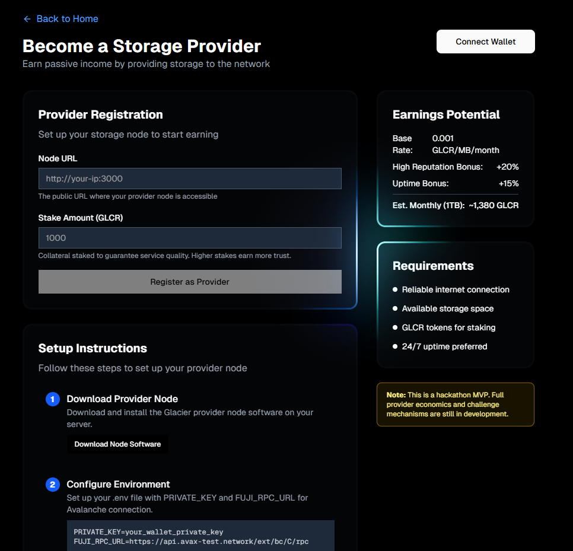
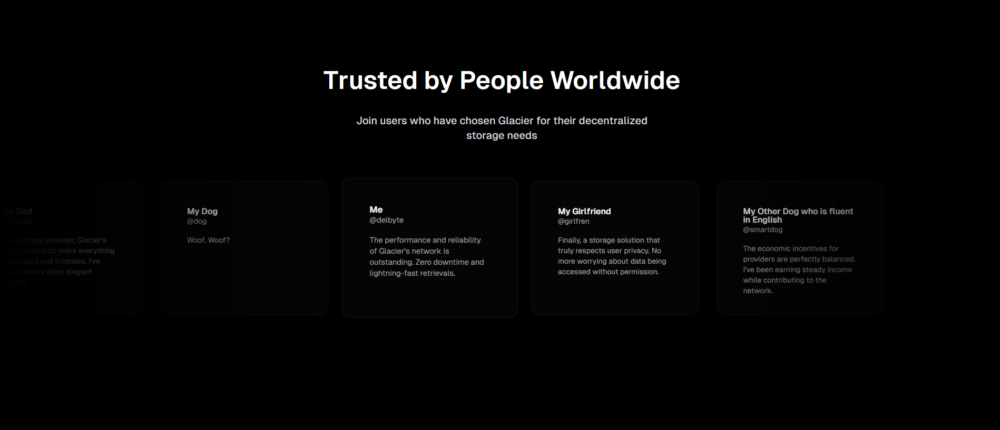

# Glacier

Glacier is a Next.js + Tailwind CSS UI for decentralized file storage, built around a custom design system (GlowCard) and tightly integrated wallet UX.

This README summarizes the project, setup steps, key files, and visual screenshots captured during development.

---

## Project Overview

- Framework: Next.js (React) with TypeScript
- Styling: Tailwind CSS + custom GlowCard component
- Wallets: wagmi + RainbowKit (UI modals replaced by custom Glacier modals)
- Popovers: Radix-style popovers (customized)
- Purpose: Provide a polished interface for uploading files to Glacier storage network, claim GLCR tokens, and manage providers

---

## Key Features

- Branded GlowCard UI used across the app for visual consistency
- Custom wallet modal replacing RainbowKit's default popup
- Custom network/chain modal for switching Avalanche networks
- Token claim modal for distributing test GLCR tokens on Avalanche Fuji
- Mobile-optimized behavior applied conditionally to avoid PC performance impact

---

## Wallet / Account UI

A custom wallet modal replaces RainbowKit's default account popup and displays the connected address, copy action, explorer link, and disconnect option.



---

## Token Claim Flow

Users can claim free GLCR tokens from a custom token modal; the flow includes an initial claim view and a success state with confirmations.





---

## Chain / Network Selection

The app provides a branded network modal to switch between Avalanche Fuji (testnet) and Avalanche Mainnet, with clear labels for testnets and explorer links.



---

## Pages & Layout

Screenshots from various pages showing responsive layout and upload/provider pages:







---

## Token Details & Explorer

Token modal includes contract details and explorer access:



---

## Misc UI States

Additional UI states and interactions captured during development:



---

## Setup (Windows PowerShell)

1. Install dependencies:

   ```powershell
   npm install
   ```

2. Start the dev server:

   ```powershell
   npm run dev
   ```

3. If you hit TypeScript chain typing errors when switching networks, ensure your `wagmi` chains in the app config include both Avalanche Fuji (`43113`) and Avalanche Mainnet (`43114`) and cast chain IDs where necessary.

---

## Important Files

- `app/` - Next.js app routes and layout
- `components/spotlight-card.tsx` - GlowCard main component (glow effect + mobile optimizations)
- `components/custom-wallet-modal.tsx` - Custom wallet/account modal replacing RainbowKit's account modal
- `components/custom-chain-modal.tsx` - Custom chain/network modal used to switch networks
- `components/custom-token-modal.tsx` - Token management modal (view balance, claim tokens)
- `components/wallet-connection.tsx` - Wallet connect UI (now uses custom modals)
- `components/token-claim.tsx` - Token claim card (now opens `CustomTokenModal`)
- `lib/` - Helper utilities (contracts, file utils)

---

## Notes & Gotchas

- All mobile-only optimizations are gated behind device detection (touch + width checks) to avoid affecting desktop performance.
- If TypeScript complains about chain literal types when using `switchChain`, cast to `any` or ensure your wagmi chain types include the union of required chain IDs.
- The GLCR contract address in `components/custom-token-modal.tsx` is a placeholder; replace it with your deployed token contract for live testing.

---

## Next Steps (suggested)

- Replace placeholder GLCR contract with deployed address
- Add end-to-end tests for wallet and network flows
- Add analytics for token claims and uploads

---

If you want more detailed captions or a different arrangement, tell me how you'd like them grouped and I'll update the README.
